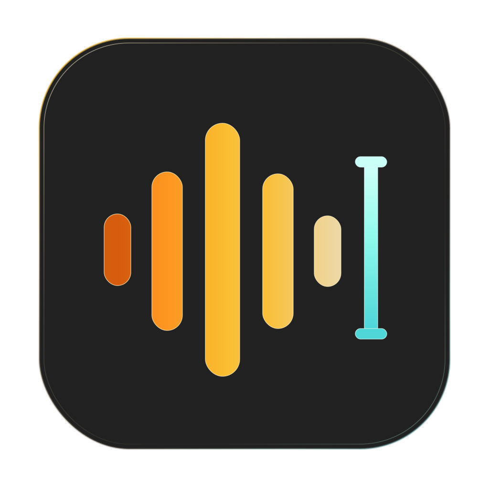

<div align="center">



# shuohua

**A lightweight voice input tool for macOS**

Press a global hotkey, speak, transcribe in real time, optionally refine the text, and insert it into the active app.

[简体中文](README.md) · [Install](#installation) · [Quick start](#quick-start) · [Docs](#documentation)

[](https://github.com/hza2002/shuohua/actions/workflows/ci.yml)
[](https://github.com/hza2002/shuohua/releases/latest)
[](https://github.com/hza2002/shuohua/releases)
[](LICENSE)


</div>

> [!IMPORTANT]
> Current releases are not signed with an Apple Developer ID. Microphone and Accessibility permissions must be granted again after the first install and after every upgrade. See [Permissions](#permissions).

## What it does

```text
    Hotkey      →     ASR     →  Process   →   Output
Right Option x2 → Apple/cloud → Rules/LLM  → Auto-paste
```

- Double-tap Right Option to start or stop recording, and press Escape to cancel; both global hotkeys are configurable.
- Show live recording, transcription, and post-processing status.
- Use cloud ASR providers such as Doubao on macOS 15+, with Apple SpeechAnalyzer available locally on macOS 26+.
- Build post-processing chains from rules and OpenAI-compatible or Anthropic LLMs.
- Select profiles, hotwords, ASR providers, and processing chains by active app.
- Inspect status, history, configuration, and diagnostics in a terminal UI.
- Hot-reload configuration and choose from built-in light and dark themes.
- Keep audio recording disabled by default. Logs do not contain transcripts, prompts, or clipboard contents.

## Requirements

| Item | Requirement |
|---|---|
| Operating system | macOS 15 or later |
| CPU | Apple Silicon; current releases provide arm64 artifacts only |
| Cloud ASR | Providers such as Doubao work on macOS 15+ |
| Apple local ASR | SpeechAnalyzer is available only on macOS 26+ |
| Permissions | Microphone and Accessibility |

## Installation

Download the latest `shuo-vX.Y.Z-aarch64-apple-darwin.tar.gz` and matching
`.sha256` file from [GitHub Releases](https://github.com/hza2002/shuohua/releases/latest).

```bash
# 1. Verify the download
shasum -a 256 shuo-vX.Y.Z-aarch64-apple-darwin.tar.gz
# The output must match the .sha256 file

# 2. Extract and install
tar -xzf shuo-vX.Y.Z-aarch64-apple-darwin.tar.gz
cd shuo-vX.Y.Z-aarch64-apple-darwin
xattr -d com.apple.quarantine ./shuo
sudo install -m 755 ./shuo /usr/local/bin/shuo

# 3. Confirm the command is available
shuo version
```

<details>
<summary>Build from source</summary>

This requires stable Rust, the Xcode 26 SDK, and an Apple Silicon Mac:

```bash
git clone https://github.com/hza2002/shuohua.git
cd shuohua
cargo build --release
sudo install -m 755 target/release/shuo /usr/local/bin/shuo
```

</details>

## Quick start

### 1. Generate configuration

Configuration lives in `~/.config/shuohua/`. Export the complete commented templates on first use:

```bash
shuo config-template --out ~/.config/shuohua --lang en-US
```

The default hotkey is a double-tap of Right Option, usually labeled Right Alt
on PC keyboards. Edit `~/.config/shuohua/config.toml` to change it:

```toml
[hotkey]
# Modifier combination
trigger = "ctrl+shift+space"
# Double-tap
# trigger = "right_option:double"
```

Then select an ASR provider:

- **All supported macOS versions**: keep `provider = "doubao"` and add credentials
  to `~/.config/shuohua/asr/doubao.toml`. The current provider authenticates
  with `app_key` and `access_key`; see the official Doubao Speech
  [legacy console quick start](https://www.volcengine.com/docs/6561/163043) for credentials and the
  [streaming speech recognition API](https://www.volcengine.com/docs/6561/1354869).
- **macOS 26+**: optionally change `provider = "doubao"` to `provider = "apple"`
  in `~/.config/shuohua/profile/default.toml` to use local SpeechAnalyzer.

The template command never overwrites existing files. Use an empty directory if you need to export them again.

### 2. Diagnose and grant permissions

```bash
shuo doctor
```

Grant Microphone and Accessibility access as instructed. To exercise the configured ASR and LLM runtime paths:

```bash
shuo doctor --runtime
```

### 3. Install the background service

```bash
shuo install
shuo status
```

`shuo install` installs and starts a per-user launchd service. Then:

1. Focus any text field and double-tap Right Option (Right Alt) to start recording.
2. Double-tap Right Option (Right Alt) again to stop and finish transcription.
3. The text is copied to the clipboard and pasted with `Cmd+V` by default.
4. Press `Escape` while recording to cancel the current input.
5. Run `shuo` in a terminal to open the status, history, and configuration TUI.

## Permissions

shuohua requires two macOS permissions:

| Permission | Purpose |
|---|---|
| Microphone | Capture speech |
| Accessibility | Observe the global hotkey and synthesize `Cmd+V` |

Current releases are unsigned. macOS TCC identifies unsigned tools by binary content, so replacing the binary during an upgrade normally requires granting both permissions again. Run `shuo doctor` after upgrading and follow its instructions.

> [!NOTE]
> Separate Input Monitoring permission is not required. The current implementation uses Accessibility for the global hotkey capability.

## Commands

| Command | Purpose |
|---|---|
| `shuo` | Open the TUI when the daemon is running, or start the daemon and open the TUI |
| `shuo doctor` | Check permissions, microphone input, configuration, and launchd state |
| `shuo doctor --runtime` | Also exercise configured ASR and LLM providers |
| `shuo config-template` | Export built-in configuration templates and themes |
| `shuo completions <shell>` | Generate zsh, bash, or fish completion scripts |
| `shuo install` | Install and start the launchd service |
| `shuo start` / `stop` / `restart` | Manage the daemon |
| `shuo status` | Show daemon PID, uptime, and recording state |
| `shuo uninstall` | Stop the service and remove its launchd configuration without deleting the binary or user data |

Completion scripts are written to stdout. Manual zsh install example for Homebrew environments:

```bash
shuo completions zsh > "$(brew --prefix)/share/zsh/site-functions/_shuo"
```

See the [CLI documentation](docs/cli.md) for the complete behavior. The developer documentation is currently written in Chinese.

## Configuration and data

| Path | Contents |
|---|---|
| `~/.config/shuohua/` | Main configuration, profiles, ASR, post-processing, and themes |
| `~/.local/state/shuohua/history/` | Monthly history files |
| `~/.local/state/shuohua/audio/` | Optional retained FLAC or AAC recordings |
| `~/.local/state/shuohua/logs/` | Daily diagnostic logs |

- Changes to `config.toml` and themes can be hot-reloaded.
- Profile, ASR, and post-processing files are read at the start of the next recording.
- History is stored as plaintext JSONL and should be treated as sensitive local data.
- Audio is not retained by default. Enabling `voice.record_audio` writes FLAC or AAC files under `audio/`.
- Cloud ASR and LLM providers receive the audio or text required by the services you configure.

## Troubleshooting

Start with:

```bash
shuo doctor
shuo status
```

Common fixes:

- Hotkeys or recording stop working after an upgrade: grant Microphone and Accessibility again.
- Configuration fails to load: use the exact file and field reported by `shuo doctor`.
- The daemon is unhealthy: run `shuo restart`, then inspect
  `~/.local/state/shuohua/logs/`.
- Apple ASR is unavailable on macOS 25 or earlier: switch to a cloud provider.

See the [troubleshooting guide](docs/debug.md) for more steps. If the problem is reproducible, open an
[issue](https://github.com/hza2002/shuohua/issues) with your macOS version, `shuo version`, and redacted diagnostics.

## Documentation

`docs/` is intended for maintainers and users who want implementation details. It is currently available in Chinese:

- [Architecture and data flow](docs/architecture.md)
- [CLI and launchd](docs/cli.md)
- [Configuration and hot reload](docs/modules/config.md)
- [ASR providers](docs/modules/asr.md)
- [Voice state machine and VAD](docs/modules/voice.md)
- [Hotkeys](docs/modules/hotkey.md)
- [Post-processing](docs/modules/post.md)
- [Overlay](docs/modules/overlay.md)
- [Protocols and data formats](docs/schema.md)
- [Troubleshooting](docs/debug.md)
- [Changelog](CHANGELOG.md)
- [Release process](docs/release.md)

## Development

```bash
cargo fmt                                  # Format Rust source files
cargo check                                # Run a fast compilation check
cargo test                                 # Run the complete test suite
cargo clippy --all-targets -- -D warnings  # Run static checks; reject warnings
```

Real macOS permission, recording, and automatic-paste behavior must be verified manually on a Mac.

## License

[MIT](LICENSE)
